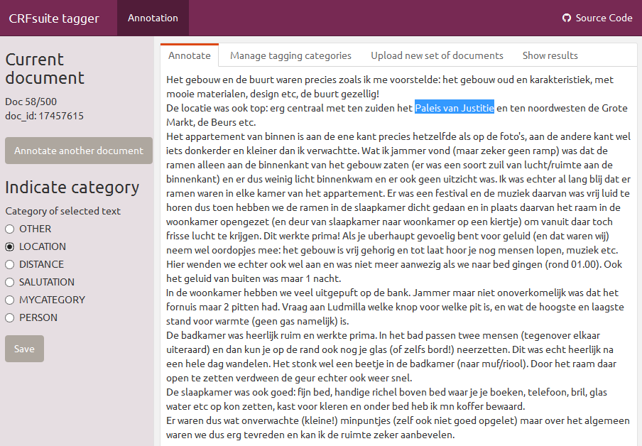

# Labelling Sequential Data in Natural Language Processing

This repository contains an R package which wraps the CRFsuite C/C++ library (https://github.com/chokkan/crfsuite), allowing the following:

- Fit a **Conditional Random Field** model (1st-order linear-chain Markov) 
- Use the model to get predictions alongside the model on new data
- The focus of the implementation is in the area of Natural Language Processing where this R package allows you to easily build and apply models for **named entity recognition, text chunking, part of speech tagging, intent recognition or classification** of any category you have in mind.

For users unfamiliar with Conditional Random Field (CRF) models, you can read this excellent tutorial http://homepages.inf.ed.ac.uk/csutton/publications/crftut-fnt.pdf

## Installation

- The package is on CRAN, so just install it with the command `install.packages("crfsuite")`
- For installing the development version of this package: `devtools::install_github("bnosac/crfsuite", build_vignettes = TRUE)`

## Model building and tagging

For detailed documentation on how to build your own CRF tagger for doing NER / Chunking. Look to the vignette.

```r
library(crfsuite)
vignette("crfsuite-nlp", package = "crfsuite")
```

#### Short example

```r
library(crfsuite)

## Get example training data + enrich with token and part of speech 2 words before/after each token
x <- ner_download_modeldata("conll2002-nl")
x <- crf_cbind_attributes(x, 
                          terms = c("token", "pos"), by = c("doc_id", "sentence_id"), 
                          from = -2, to = 2, ngram_max = 3, sep = "-")

## Split in train/test set
crf_train <- subset(x, data == "ned.train")
crf_test <- subset(x, data == "testa")

## Build the crf model
attributes <- grep("token|pos", colnames(x), value=TRUE)
model <- crf(y = crf_train$label, 
             x = crf_train[, attributes], 
             group = crf_train$doc_id, 
             method = "lbfgs", options = list(max_iterations = 25, feature.minfreq = 5, c1 = 0, c2 = 1)) 
model

## Use the model to score on existing tokenised data
scores <- predict(model, newdata = crf_test[, attributes], group = crf_test$doc_id)

table(scores$label)
 B-LOC B-MISC  B-ORG  B-PER  I-LOC I-MISC  I-ORG  I-PER      O 
   261    211    182    693     24    205    209    605  35297 
```


## Build custom CRFsuite models

The package itself does not contain any models to do NER or Chunking. It's a package which facilitates creating **your own CRF model** for doing Named Entity Recognition or Chunking **on your own data** with your **own categories**.

In order to facilitate creating training data of your own text, a shiny app is made available in this R package which allows you to easily tag your own chunks of text, using your own categories. 
More details about how to launch the app, which data is needed for building a model, how to start to build and use your model - read the vignette *in detail*: `vignette("crfsuite-nlp", package = "crfsuite")`.




## Support in text mining

Need support in text mining?
Contact BNOSAC: http://www.bnosac.be
